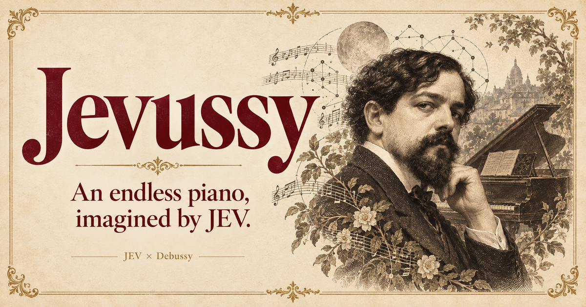
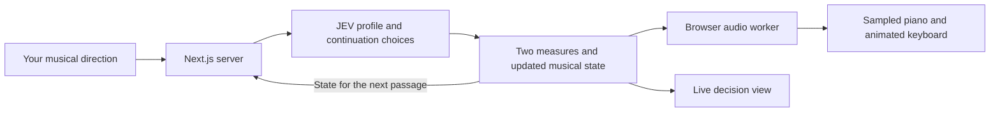

<div align="center">

<a href="https://jevussy.arshan.to">
  
</a>

# Jevussy

**A little Debussy. A little JEV. A piano that keeps finding its next thought.**

[](https://jevussy.arshan.to)
[](https://jevussy.arshan.to)
[](https://jevussy.arshan.to)
[](https://jevussy.arshan.to)

[**Enter the recital →**](https://jevussy.arshan.to) · [How it works](#how-it-works) · [Run locally](#run-locally) · [Development](#development)

</div>

---

Jevussy turns a written musical direction into an unfolding piano performance. Give it a mood, a scene, or a more precise musical idea, then listen as JEV chooses where the music goes next. Watch those decisions arrive alongside an animated 88-key keyboard.

The name is **JEV + Debussy**. Its default world is intimate and impressionistic: a singing melody, quiet bass anchors, flowing broken chords, added-note harmonies, and room between gestures. The music moves through statements, departures, a crest, and transformed returns. Each new visit offers another way into that world.

## The recital

| | What you experience |
| :--- | :--- |
| **An unfolding performance** | New two-measure passages are chosen while earlier passages play. The composition continues until you stop it. |
| **A sampled piano** | SoundFont-based piano synthesis, independent musical voices, sustain pedal, and resonance carried across passage boundaries. |
| **A different entrance** | 1,296 compatible combinations of key, pace, opening texture, melodic contour, phrasing, and section length. |
| **Your direction** | An editable prompt accompanies every JEV request. **New variation** offers another starting point; **Begin anew** starts its performance. |
| **Decisions you can see** | Live JSON, model choices, request timing, and the amount of music buffered ahead. |
| **A classical setting** | Parchment, burgundy, illustrated artwork, and a responsive layout for desktop and mobile. |

The default variations preserve a gentle 9/8 nocturne character. With the first-party variation cookie available, a return visit changes at least the opening texture, melodic contour, or phrasing. Your edited prompt remains yours; the cookie stores only a variation number.

## How it works

JEV is the musical decision maker. A TypeScript composition engine supplies concrete, playable possibilities; JEV selects among them in the context of your prompt and the evolving piece. The selected candidate determines the notes, timing, voicing, and expressive events that the piano renders.



1. **Set the character.** JEV chooses a tonal center, meter, perceived pulse, touch, motif, opening texture, phrasing, and section span from the listener’s direction.
2. **Choose the next passage.** The engine presents playable two-measure candidates. JEV receives the original prompt and musical state, then chooses a continuation that develops the piece.
3. **Compose ahead of the sound.** Continuations are requested in order because each depends on the previous decision. Those requests overlap with playback. An adaptive buffer targets roughly 8–24 seconds of music, based on observed latency.
4. **Keep the piano connected.** A worker renders stereo PCM through alphaTab’s synthesizer and the bundled TimGM6mb SoundFont. Web Audio schedules the buffers; the synthesizer preserves active voices and pedal state across passages.

The initial response streams newline-delimited JSON events for connection, profile, opening passage, and completion. Later continuations return JSON. The on-screen feed exposes those application events and JEV’s structured answers; it is not a token-by-token text stream.

## Run locally

Use **Bun 1.3.14** and a TypeSafe/JEV API key with access to `jev-latest`.

```bash
git clone https://github.com/arshankhanifar/jevussy.git
cd jevussy
bun install --frozen-lockfile
cp .env.example .env.local
```

Set `TYPESAFE_API_KEY` in `.env.local`, then start the app:

```bash
bun run dev
```

Open **http://localhost:3000** and start the recital. Playback begins after a user gesture, including on mobile browsers. The piano samples are served with the app; generating new music requires a working JEV connection.

The API key belongs on the server. `.env.local` is ignored by Git, and the browser calls the app’s `/api/compose` endpoint rather than contacting TypeSafe with a key.

## Development

| Command | Purpose |
| :--- | :--- |
| `bun run dev` | Compile the piano worker and start the development server. |
| `bun run build:piano` | Rebuild the browser audio worker. |
| `bun test` | Run musical, variation, audio, player, and compiled-worker tests. |
| `bun run lint` | Run ESLint. |
| `bun run build` | Compile the worker and create a production Next.js build. |
| `bun run start` | Serve the production build. |

The GitHub Actions workflow installs the locked dependencies, rebuilds the worker, runs tests and lint, and builds the app. These checks do not need a JEV API key. Live composition smoke tests are separate and require a configured server.

<details>
<summary><strong>A map of the score</strong></summary>

```text
app/
  page.tsx                 Per-visit prompt selection
  recital.tsx              Piano UI, decision feed, and playback orchestration
  api/compose/route.ts     Server-only JEV API boundary
lib/
  prompt-variations.ts     The constrained starting-prompt palette
  jev.ts                   Musical instructions and JEV choice requests
  music.ts                 Profiles, motifs, candidates, and composition state
  audio/
    timeline.ts            Musical events translated into playback timing
    synth.ts               Stateful sampled-piano synthesis
    worker.ts              Audio rendering off the main thread
    player.ts              Web Audio scheduling and keyboard timing
public/                    Artwork, icons, piano runtime, and SoundFont
tests/                     Music and audio regression coverage
cloudflare/                Custom-domain proxy to Cloud Run
```

</details>

## Deployment

The live recital runs on **Google Cloud Run**, with a **Cloudflare Worker** connecting `jevussy.arshan.to` to the service. The included Dockerfile builds and serves the app with Bun. `wrangler.jevussy.jsonc` describes the custom-domain proxy.

In production, `TYPESAFE_API_KEY` is injected into the server at runtime from **Google Secret Manager**. It is not a build argument or a client-side environment variable. The proxy configuration contains the existing deployment’s origin and domain; adjust both for a separate installation.

## Built with

**Bun · TypeScript · Next.js · React · JEV · alphaTab · Web Audio · Cloud Run · Cloudflare**

Created by **[Arshan Khanifar](https://github.com/arshankhanifar)**. The visual and musical direction draws on Debussy’s piano writing while asking for original performances rather than quotations. Piano playback uses alphaTab and the TimGM6mb SoundFont; bundled third-party components retain their respective licenses.

---

<div align="center">

**A new direction. A familiar instrument. Another place for the melody to go.**

[**Listen at jevussy.arshan.to →**](https://jevussy.arshan.to)

</div>
